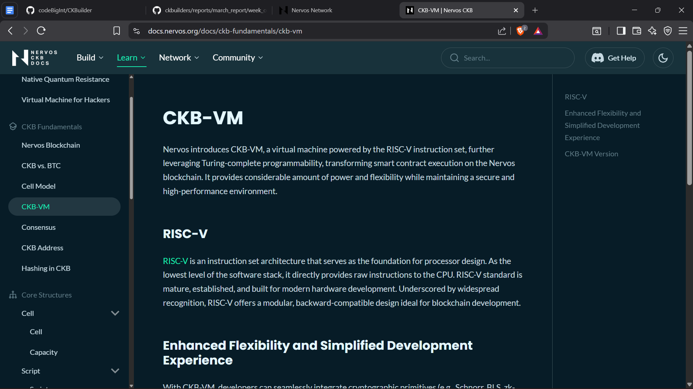
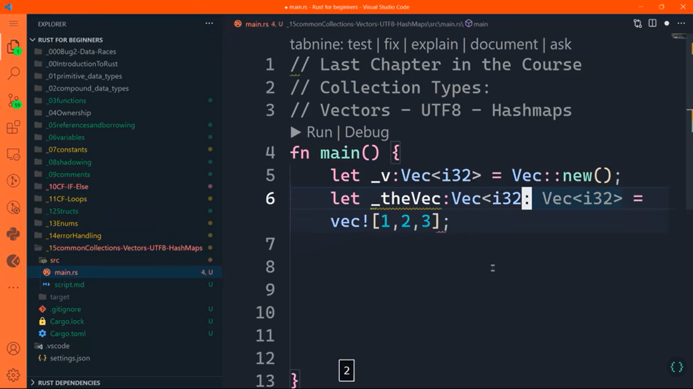
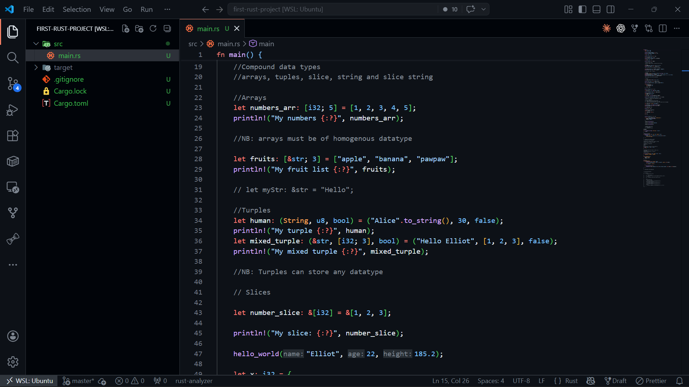

# Build Track Weekly Report - WEEK 4
## Name: Elliot Lucky
## Date: Thursday, 30th May, 2026.

### Progress Log

**1**. Documentation Readthrough: Spent time going through the entire nervos ckb blockchain documentations and refrence resources including linked webpages and research papers to grasp the major concept behind innovation of the CKB blockchain which made thing alot clearer and vivid. The documentations were absolutely amazing and for a beginner on CKB, it really went the extra mile to explain important fundamental concept from the very basics. *Major Concepts learnt:*
- The Tragedy of the commons and state of explosion
- Design pattern of the CKB-VM for comtract upgradability and backward compatibility
- Cell Model
- Why CKB is Native Quantum-Resistant
- What Scripts are  in CKB blockchain by 

**2**. Rust Programming Crash Course: Practiced programming with rust following a youtube tutorial video guide by BeckBrace to become profficient in rust while also realating the concept with previous ideas from other programming languages in my development stack.

Video Link: [https://www.youtube.com/watch?v=rQ_J9WH6CGk](https://www.youtube.com/watch?v=rQ_J9WH6CGk)

