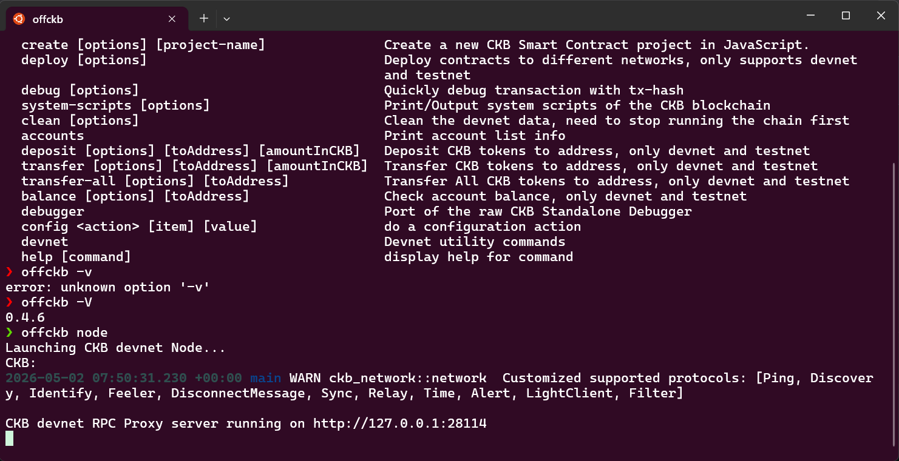
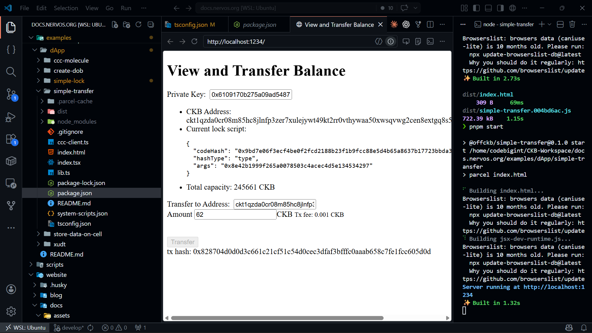
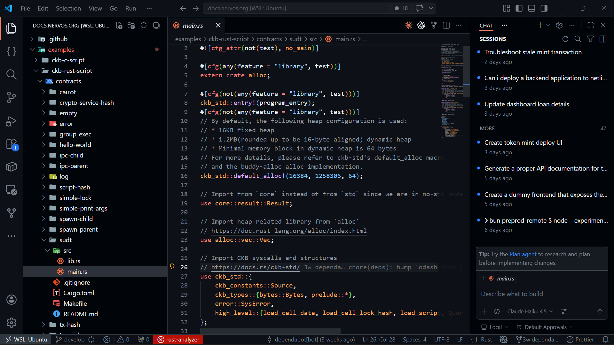

# Build Track Weekly Report - WEEK 3
## Name: Elliot Lucky
## Date: Friday, 24th April, 2026.

### Progress Log

1. Offckb cli installation and workaround: Following the guide provided in the nervos ckb documentation, offckb cli tool was installed on my wsl environment and used to run a devnet node.
2. Example DApp deployment and testing: Deployed and tested my first ever CKB Dapp, the simple transfer DAPP that uses CCC toolchain/SDK 
3. Example git repository quick waltkthrough: Cloned the official docs.nervos.org github example repository and went through the codes to get a quick overview of what it looks like to work on the Nervos CKB Blockchain

