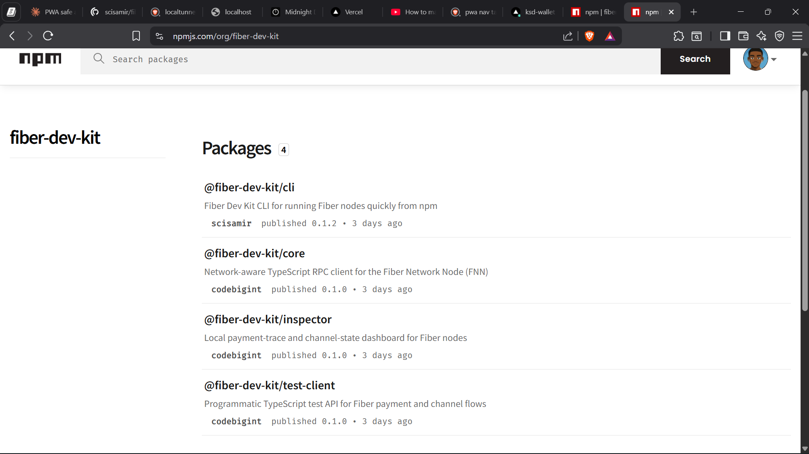
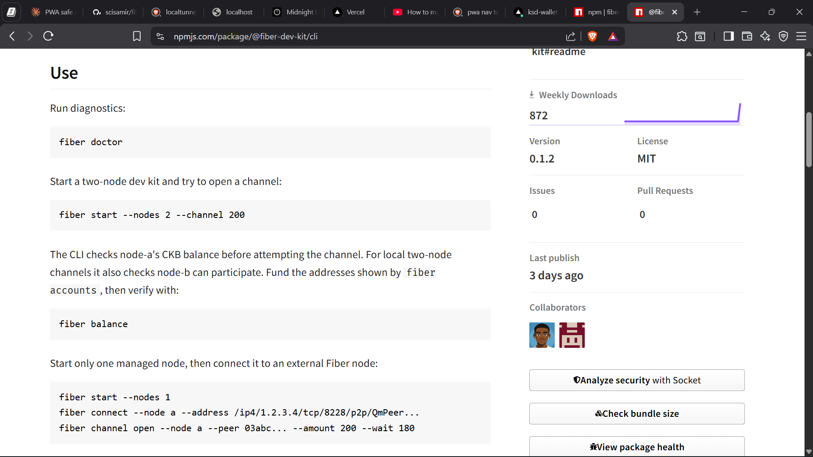
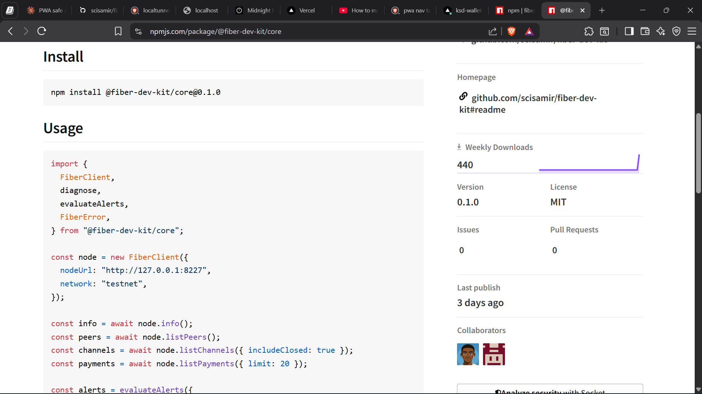
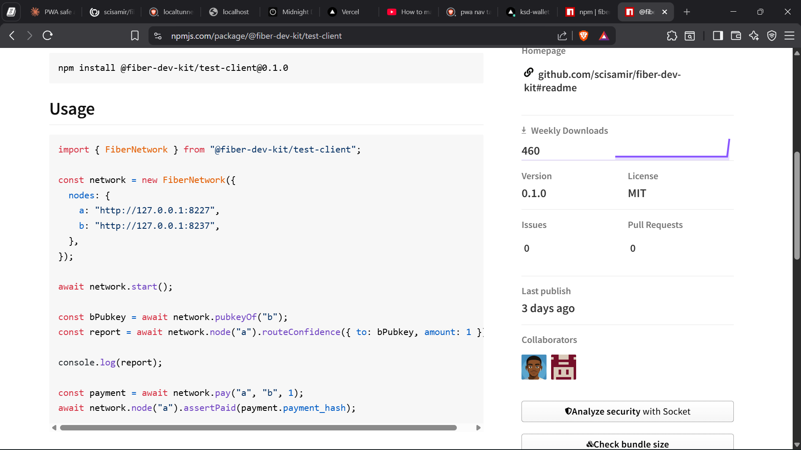
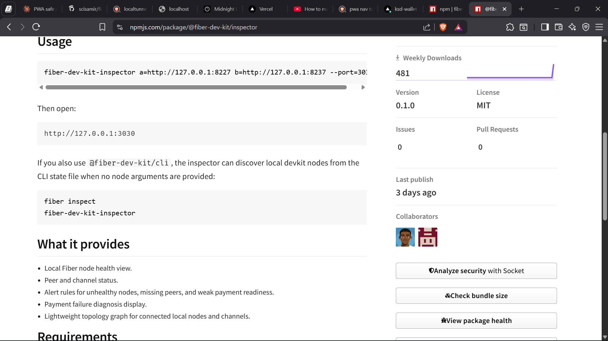

# Builder Track Report - Week 3

***Name***: Elliot Lucky

***Week Ending***: 17-07-2026

## Courses Completed

- Completed my participation in the **Gone in 60ms: Fiber Network Infrastructure Hackathon**, where my team **LucentLabs** submitted **fiber-dev-kit**.
- Studied how to package and distribute developer infrastructure through npm so that other builders can install and use Fiber tooling without cloning or configuring the project manually.
    - How to structure a multi-package toolkit under a single npm organisation
    - How to design each package around one clear developer responsibility
    - How versioning and publishing workflows keep a toolkit maintainable after a hackathon
- Deepened my understanding of Fiber node operations, payment channel flows, and node health monitoring through the process of finalising the toolkit for submission.

## Key Learning

- Learned that shipping infrastructure as installable packages is what turns a hackathon project into something developers can actually adopt. A published toolkit lowers the entry barrier far more than a repository alone.
- Understood the value of separating a dev kit into focused packages instead of a single tool. Each part of the developer journey, from starting nodes to testing payments to inspecting channel state, deserves its own well-scoped entry point.
- Improved my ability to deliver as part of a team under a deadline by dividing package responsibilities, reviewing each other's work, and coordinating the final submission as **LucentLabs**.
- Gained practical experience with the publishing side of open source infrastructure, including preparing documentation, usage examples, and install instructions for each package.

## Practical Progress

- Finalised and submitted **fiber-dev-kit** for the **Gone in 60ms: Fiber Network Infrastructure Hackathon** as part of team **LucentLabs**.
- Published the toolkit to npm under the **@fiber-dev-kit** organisation as four packages:
    - **@fiber-dev-kit/cli** - a CLI for running Fiber nodes quickly from npm, with commands for starting multi-node dev kits, opening channels, checking balances, and running diagnostics with `fiber doctor`
    - **@fiber-dev-kit/core** - a network-aware TypeScript RPC client for the Fiber Network Node (FNN), exposing node info, peers, channels, payments, and alert evaluation
    - **@fiber-dev-kit/test-client** - a programmatic TypeScript test API for Fiber payment and channel flows, allowing developers to spin up a multi-node network and assert payment outcomes in code
    - **@fiber-dev-kit/inspector** - a local payment-trace and channel-state dashboard for Fiber nodes, with node health views, peer and channel status, alert rules, and a topology graph
- Worked with the team to complete each package's documentation and usage examples so developers can go from `npm install` to a running Fiber setup with minimal friction.
- Verified the developer flow end to end, from starting nodes with the CLI, to testing payments with the test client, to inspecting channel state through the dashboard.

## Screenshots

Github Link: https://github.com/scisamir/fiber-dev-kit

NPM Organization: https://www.npmjs.com/org/fiber-dev-kit

NPM Packages:
--
https://www.npmjs.com/package/@fiber-dev-kit/cli

https://www.npmjs.com/package/@fiber-dev-kit/core

https://www.npmjs.com/package/@fiber-dev-kit/test-client

https://www.npmjs.com/package/@fiber-dev-kit/inspector
