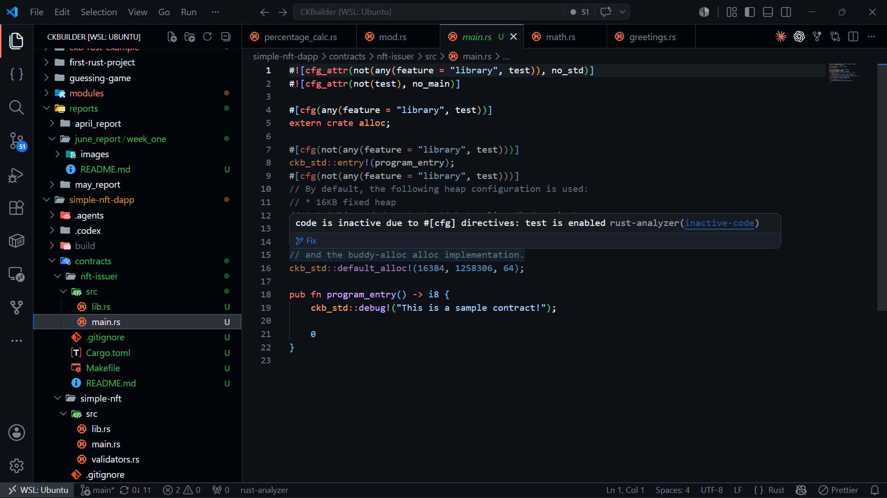
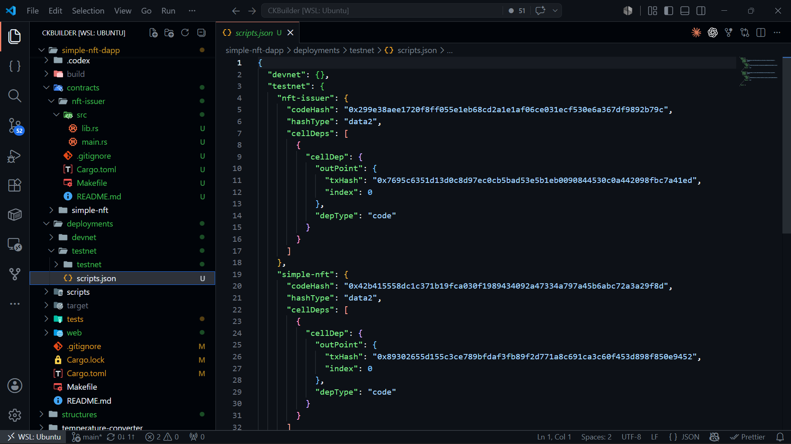
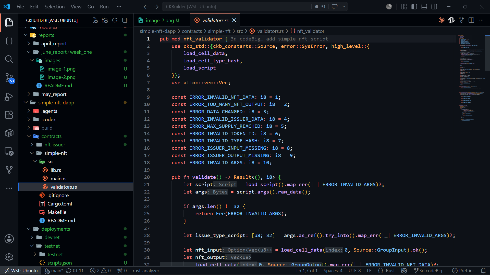

# Builder Track Report - Week 1

***Name***: Elliot Lucky

***Week Ending***: 05-06-2026

## Courses Completed

- Studied the CKB cell model in depth, focusing on how type scripts enforce ownership and token rules in the UTXO model
    - Cell data layout and custom encoding
    - Type script lifecycle: creation, transfer, and destruction
    - How type scripts use args to parameterize behavior per deployment
    - Source-based cell indexing with `Source::GroupInput` and `Source::GroupOutput`
- Reviewed the CKB-STD library APIs used in on-chain scripts
    - `load_script`, `load_cell_data`, `load_cell_type_hash`
    - `SysError::IndexOutOfBound` for iterating over cells
    - The `no_std` / `no_main` contract environment and memory allocator setup
- Explored the CCC (CKB Components Collection) SDK for building dApp frontends
    - `@ckb-ccc/connector-react` wallet connector and `useSigner` / `useCcc` hooks
    - `ccc.Transaction` composition: adding inputs, outputs, and completing capacity and fees
    - `findCellsByType` and `findCellsByLock` for querying live cells from the testnet RPC

## Key Learning

- Understood how two cooperating type scripts can enforce a supply-capped NFT system on CKB without any off-chain authority:
    - The **nft-issuer** script holds an 8-byte cell (current supply + max supply) and acts as the mint authority. Its type hash is embedded into the NFT script's args, creating a hard on-chain link between the two scripts.
    - The **simple-nft** script validates both mint and transfer scenarios. On mint it requires a matching issuer cell in inputs/outputs and enforces that `token_id == old_supply + 1` and that the issuer's `current_supply` is incremented by exactly one. On transfer it enforces that cell data is immutable and that one NFT cannot be split into multiple cells.
- Learned how to encode structured binary data inside CKB cells using little-endian integers and length-prefixed byte arrays — matching the exact layout validated by the on-chain script.
- Gained hands-on experience building a full transaction flow in the browser: reading live issuer state from the testnet, constructing a mint transaction with correct cell deps, and submitting it through a connected wallet.
- Understood the role of cell deps in making deployed script code available to the CKB VM when validating a transaction.

## Practical Progress

- Built two CKB type scripts in Rust:
    - **`nft-issuer`** — tracks `current_supply` and `max_supply` as packed `u32` values. Deployed to testnet as the mint authority.
    - **`simple-nft`** — full validation logic covering the mint path (issuer supply check, token ID assignment) and the transfer path (immutability enforcement, no-splitting rule). Implements ten distinct error codes for precise on-chain failure reporting.
- Built a React + TypeScript frontend (`web/`) with Vite and the CCC SDK:
    - Wallet connect / disconnect flow using `@ckb-ccc/connector-react`
    - **Create Issuer** panel: deploys a new issuer cell with a configurable max supply
    - **Mint NFT** form: accepts a name and metadata URI, builds and submits the full mint transaction, links to the submitted tx on the Nervos Pudge explorer
    - **Owned NFTs** panel: scans the connected wallet for NFT cells and displays token ID, name, and URI
    - Live issuer state display: current supply, max supply, next token ID, issuer type hash, and outpoint
- Deployed both contracts to CKB testnet and wired the deployment metadata (code hash, hash type, cell deps) into the frontend config.
- Wrote contract test scaffolding using `ckb-testtool` for both the `simple-nft` and `nft-issuer` contracts.

