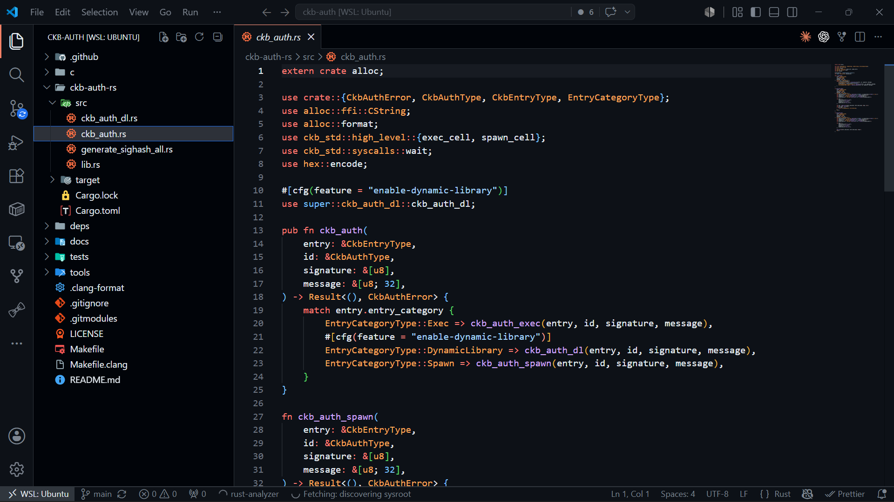
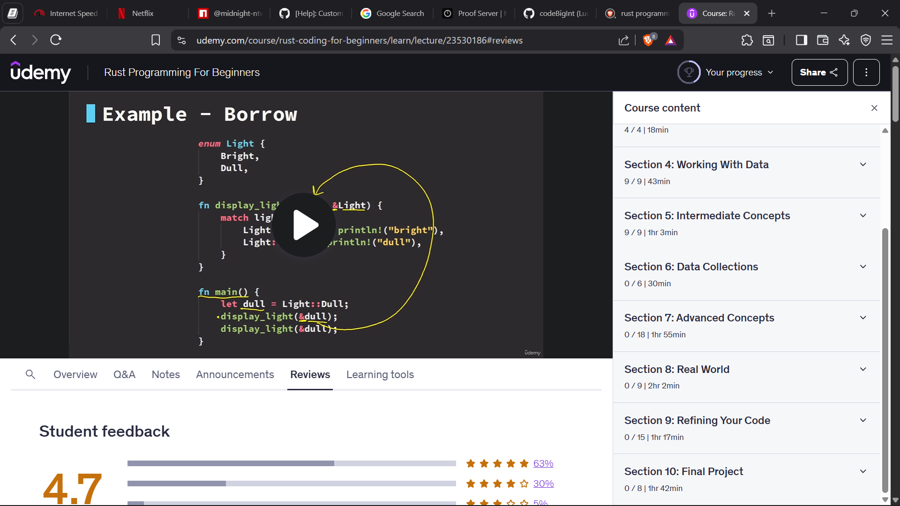

# Builder Track Report - Week 3

***Name***: Elliot Lucky

***Week Ending***: 19-06-2026

## Courses Completed

- Started delving into the `ckb-auth` repository to understand how authentication and signature verification works across different wallet schemes on CKB.
    - How `ckb-auth` abstracts different lock algorithms
    - How dynamic loading is used to call auth libraries inside CKB scripts
    - How witness data is parsed and verified during transaction validation
- Purchased a Rust course to become more proficient in Rust and improve my ability to work on low-level CKB script logic.
- Reviewed more Rust concepts that are important for understanding and extending CKB contracts:
    - Traits and generics
    - Error handling
    - Modules and crate structure
    - Working with external dependencies through Cargo

## Key Learning

- Understood that `ckb-auth` can help simplify wallet support by allowing different signature algorithms to be verified through one authentication flow.
- Gained better understanding of how CKB lock scripts can support multiple wallet types without forcing users into one fixed wallet design.
- Understood why adding Midnight wallet authentication support into `ckb-auth` is important for Veil Credit Scoring Protocol, since users should not need to manage double wallets before they can interact with CKB.
- Improved my understanding of why stronger Rust knowledge is necessary for safely contributing to `ckb-auth`, especially because small mistakes in script logic can affect transaction validation.

## Practical Progress

- Spent time reading through the `ckb-auth` repo structure and identifying the parts related to auth entry, algorithm selection, and witness verification.
- Started mapping how Midnight authentication could fit into the existing `ckb-auth` pattern.
- Purchased and began preparing to follow a dedicated Rust course in order to become more proficient in Rust for CKB development.
- Refined the direction for Veil Credit Scoring Protocol so that the user experience can become simpler: one authentication path that makes Midnight and CKB interaction smoother without requiring users to switch between double wallets.

