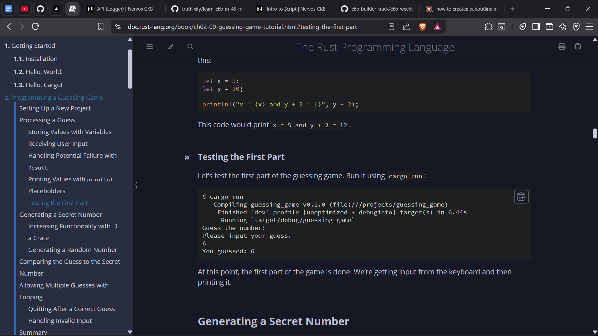
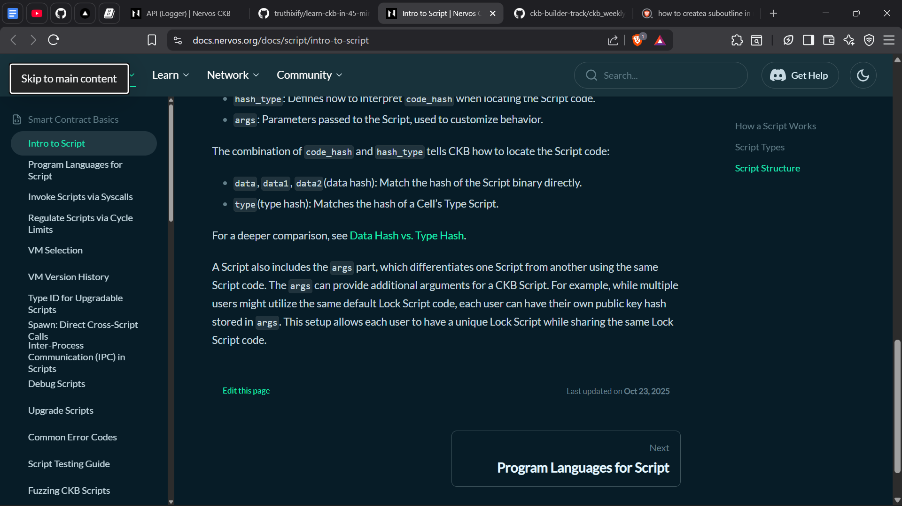
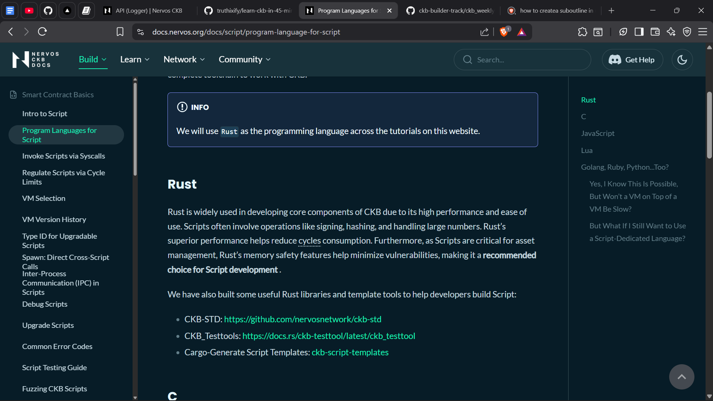
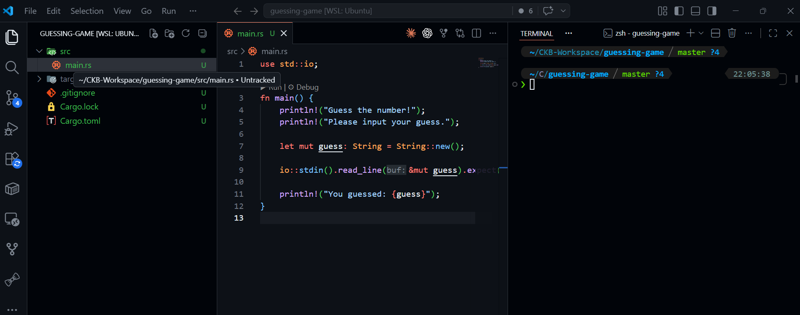

# Builder Track Report - Week 1

***Name***: Elliot Lucky

***Week Ending***: 8-05-2026

## Courses Completed

- Completed a 3hrs youtube rust tutorial video serving as an overview on rust programming   
- Explored the first 2 Modules of the Rust book
- Read Nervos CKB documentation on scripts in CKB and how they are utilized in transactions.
    - Introduction to Scripts
    - How script works
    - Script types
        - Lockscript
        - Typescript
    - Components of a Script

## Key Learning

- Gained proper overview of required concpets for writting efficient rust code from the turtorial video.These includes:
    - Referencing
    - Ownership and borrowing
    - Memory management
    - Distinctions between the heap and the stack
- Understood how to setup developer environment for developing rust programs using cargo and its relevance to rust developers
- Became familiar with the necessity for script and how to describe the conditions that must be met to utilize onchain cell in the CKB UTXO Cell model.

## Practical Progress
- Built the guessing game project from the Rust book that utilizes the `io` standard library prelude from the rust standard library, `std`.
- Watched a few videos on rust projects for beginners built in realtime

