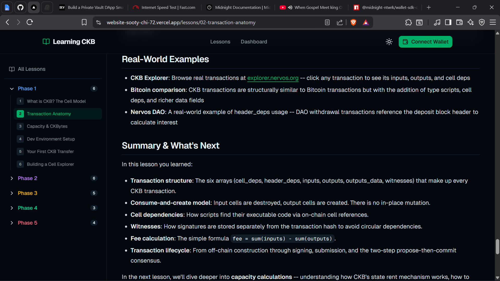
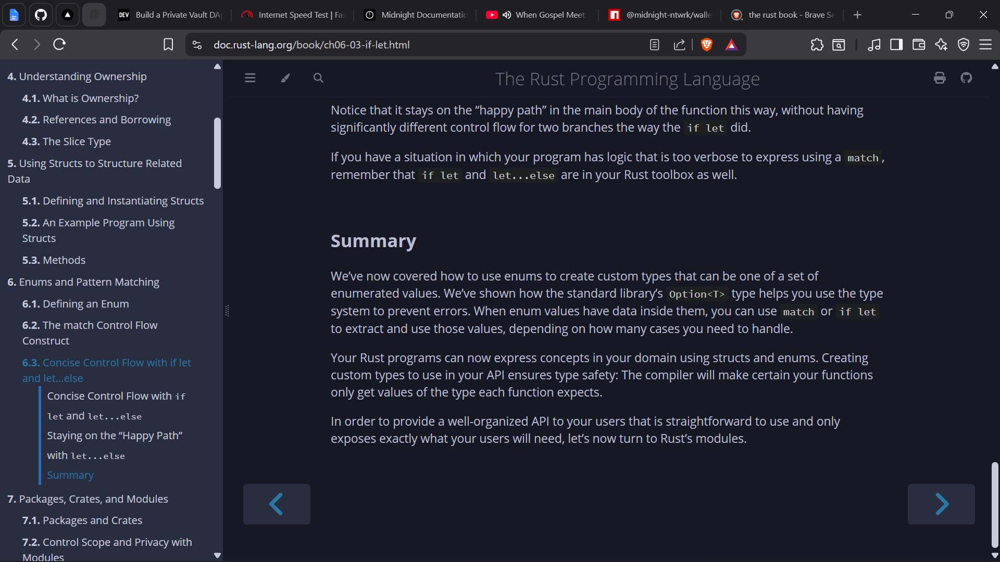
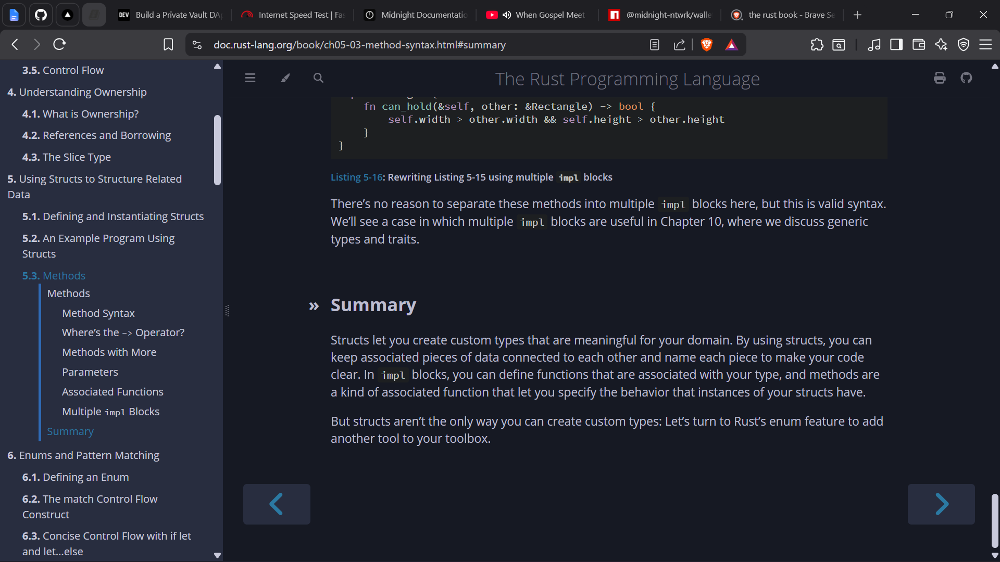
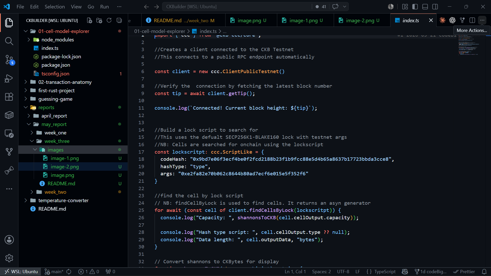
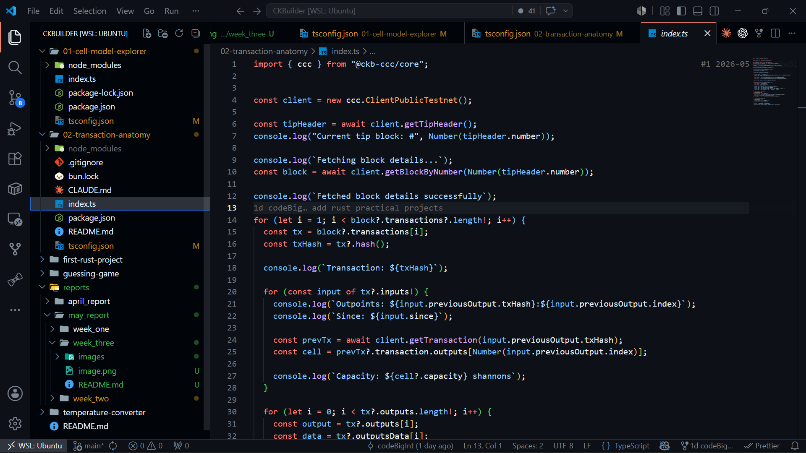

# Builder Track Report - Week 3

***Name***: Elliot Lucky

***Week Ending***: 22-05-2026

## Courses Completed

- Explored module 5 & 6 of the Rust book
    - Structs and their methods
    - Enums and Pattern Matching
- Continued "Learning CKB - 24 lessons across 5 phases" documentation (Phase 2).
    - Transaction Anatomy in CKB
    - Structure of a CKB transaction (inputs, outputs, cell deps, witnesses)
    - How scripts are referenced and executed within a transaction

## Key Learning

- Deepened understanding of Rust's type system through modules 5 & 6. Key concepts:
    - Defining and instantiating Structs
    - Associated functions and methods using `impl` blocks
    - Tuple structs and unit-like structs
    - Enums as a means of encoding variants and meaning into types
    - The `Option<T>` enum and how Rust handles the absence of a value
    - `match` expressions and exhaustive pattern matching
    - `if let` as concise control flow for single-pattern matching
- Gained a thorough understanding of how CKB transactions are structured:
    - Transactions consume input cells and produce output cells
    - Cell deps supply read-only context (scripts, libraries) without being consumed
    - Witnesses carry authorization data (signatures, proofs) required by lock scripts
    - The distinction between lock scripts (who can spend) and type scripts (what rules apply)
    - How the CKB VM executes scripts referenced across inputs, outputs, and cell deps

## Practical Progress

- Built the **Cell Model Explorer** — an interactive tool to inspect and visualize the structure of CKB cells, including capacity, lock, type, and data fields.
- Built the **Transaction Anatomy** project — a hands-on project that constructs and decodes CKB transactions to demonstrate how inputs, outputs, cell deps, and witnesses fit together.

